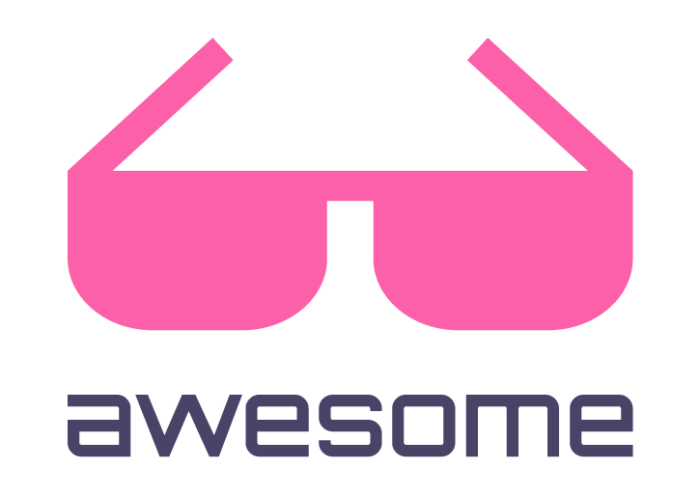

# Web Awesome

<!-- region badges -->

<!-- endregion -->

_An Awesome Web Framework to build connected and
Telenor-integrated applications
in Kotlin with minimal efforts._

> **Warning**
>
> This is very much still a work in progress, expect a lot of changes. Also,
> don't look in the examples folder, there will be breaking changes and the
> final
> product is not represented in the examples directory, yet!

  

**Table of Contents**
<!-- @formatter:off -->
<!-- TOC -->
* [Web Awesome](#web-awesome)
<!-- TOC -->
<!-- @formatter:on -->

<!-- region Links -->

[Jetbrains]: https://www.jetbrains.com

[Ktor]: https://github.com/ktorio/ktor

[Swagger]: https://swagger.io

<!-- endregion -->
